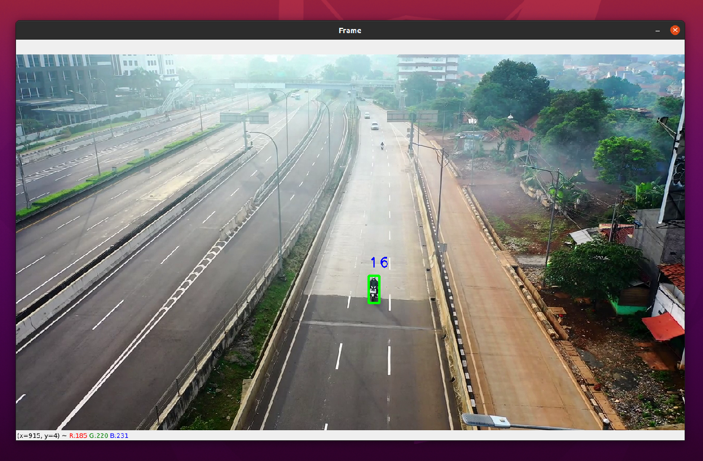
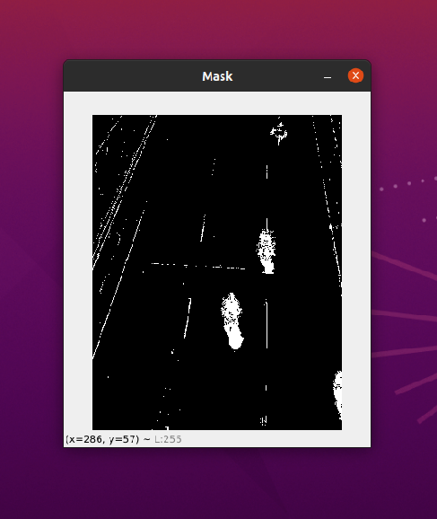
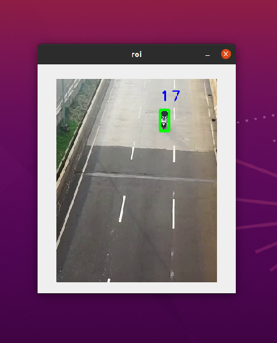

OpenCV (Open source Computer Vision) é uma biblioteca muito poderosa para tarefas de processamento de imagens
e aprendizado de máquina. A biblioteca é multiplataforma e você pode instalá-la pip (onde você a estiver usando com Python) com suporte de CPU.
Alternativamente, onde por exemplo você deseja usá-lo com suporte a GPU, você pode construí-lo a partir do código-fonte, que é mais complexo.

O pacote instalado foi **opencv-contrib-python**, não é um pacote oficial da equipe [OpenCV](openCV.org), mas é mensionado na documentação e apresentado alguns tutorias. Esse diretório contém dois módulos principais junto com todas as funcionalidades do OpenCV padrão.
Ele foi instalado pois havia bibliotecas necessárias para o monitorando de movimentação de objetos na imagem. Este é seu comando para instalação:

>sudo apt update

>sudo apt install python3-pip

>python3 -m pip install opencv-python

---
### Introdução
O objetivo to projeto é monitorar os veículos passando em baixo de um viaduto em um vídeo e contá-los, com isso foi utilizado uma função de verificação de objeto de câmera estável chamada: **cv2.createBackgroundSubtractorMOG2**.

No script, a cada frame do vídeo capturado é verificado se há um novo objeto(Imagem 1), e nesse loop é usada uma técnica de máscara, onde o toda a tela é definida na cor preta e as bordas de objetos com tamanho acima de 100 pixels são de cor branca, assim facilitando o reconhecimento (isso é apresentado na janela "mask")(Imagem 2). Também é extraída do vídeo uma região de interesse, onde é localizada uma rodovia, com isso diminuindo bastante o número de erro nas contagens (isso é apresentado na janela "roi")(Imagem 3).

Após a identificar os veículos a função **tracker.update()** é utilizada, ela define a contagem do objeto em movimento, se mudando de local na tela. Com isso é criada um retangulo em volta do veículo e é salvo em um vetor (temporário) o local do objeto no eixo x e y, no pixel do vídeo e também um ID para ele.

Assim que o vídeo acaba as janelas nas fechadas e os valores apresentados no terminal não são salvos.

##Imagem 1

##Imagem 2

##Imagem 3
